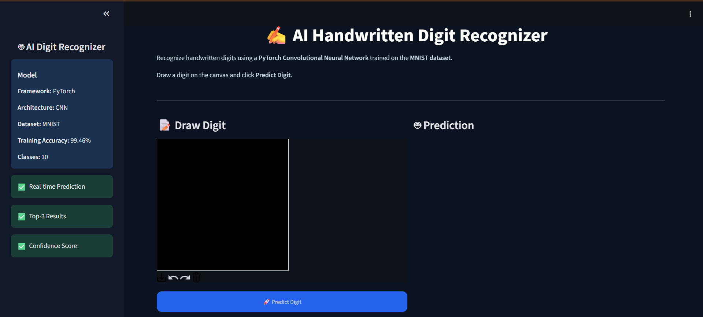
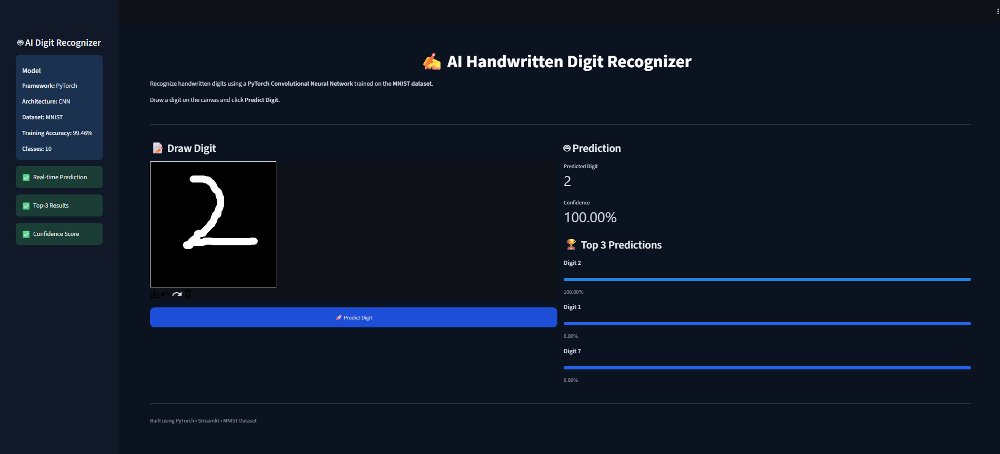
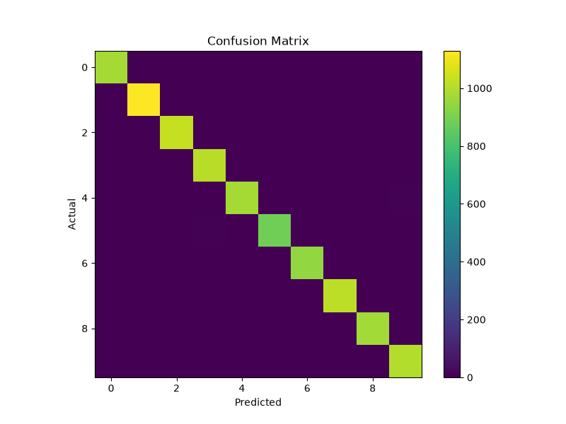
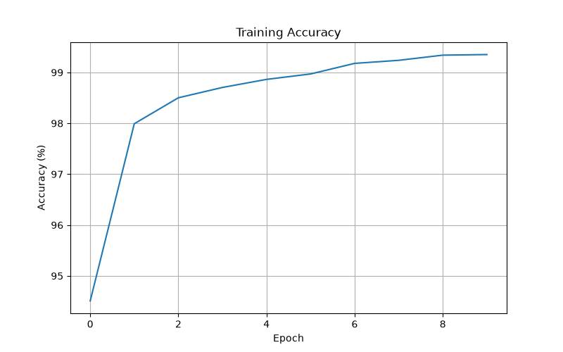
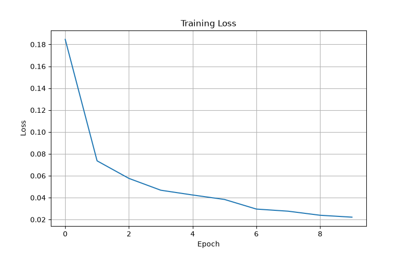

# AI Handwritten Digit Recognizer

A Deep Learning based Handwritten Digit Recognition System built using **PyTorch** and **Streamlit**. The application allows users to draw handwritten digits on an interactive canvas and predicts the digit in real time using a Convolutional Neural Network (CNN).

---

## Features

- Real-time handwritten digit prediction
- PyTorch CNN model trained on the MNIST dataset
- Interactive drawing canvas built with Streamlit
- Top-3 predictions with confidence scores
- Model evaluation using Confusion Matrix
- Training Accuracy and Loss visualization
- Modular and clean project architecture

---

## Tech Stack

- Python
- PyTorch
- Torchvision
- Streamlit
- NumPy
- Pillow
- Matplotlib

---

## Project Structure

```text
Handwritten_Digit_Recognizer/

├── app.py
├── train.py
├── evaluate.py
├── confusion_matrix.py
├── plot_history.py
├── config.py
├── requirements.txt
├── README.md
│
├── assets/
│   └── style.css
│
├── models/
│   └── best_model.pth
│
├── outputs/
│   ├── history.json
│   ├── confusion_matrix.png
│   ├── accuracy_graph.png
│   └── loss_graph.png
│
├── screenshots/
│   ├── home.png
│   ├── prediction.png
│   ├── confusion_matrix.png
│   ├── accuracy_graph.png
│   └── loss_graph.png
│
└── src/
    ├── dataset.py
    ├── model.py
    ├── predictor.py
    ├── preprocess.py
    ├── evaluation.py
    ├── trainer.py
    └── utils.py
```

---

## Installation

Clone the repository

```bash
git clone https://github.com/your-username/Handwritten_Digit_Recognizer.git
```

Move into the project directory

```bash
cd Handwritten_Digit_Recognizer
```

Create a virtual environment

```bash
python -m venv .venv
```

Activate the virtual environment

**Windows**

```bash
.venv\Scripts\activate
```

Install dependencies

```bash
pip install -r requirements.txt
```

---

## Train the Model

```bash
python train.py
```

The trained model will be saved inside the **models/** directory.

---

## Run the Application

```bash
streamlit run app.py
```

---

## Evaluate the Model

Generate model evaluation metrics

```bash
python evaluate.py
```

Generate confusion matrix

```bash
python confusion_matrix.py
```

Generate training graphs

```bash
python plot_history.py
```

---

# Application Preview

## Home Screen

<p align="center">

</p>

---

## Prediction Result

<p align="center">

</p>

---

# Model Evaluation

## Confusion Matrix

<p align="center">

</p>

---

## Training Accuracy

<p align="center">

</p>

---

## Training Loss

<p align="center">

</p>

---

## Model Information

| Attribute | Value |
|-----------|-------|
| Framework | PyTorch |
| Model | Convolutional Neural Network (CNN) |
| Dataset | MNIST |
| Number of Classes | 10 |
| Input Size | 28 × 28 |
| Output | Digit Prediction (0–9) |

---

## Future Improvements

- Support custom datasets
- Export trained model to ONNX
- Deploy using Docker
- REST API using FastAPI
- Mobile-friendly interface

---

## Author

**Patil Praful Sajan**

Final Year Computer Engineering Student

AI / Machine Learning Enthusiast